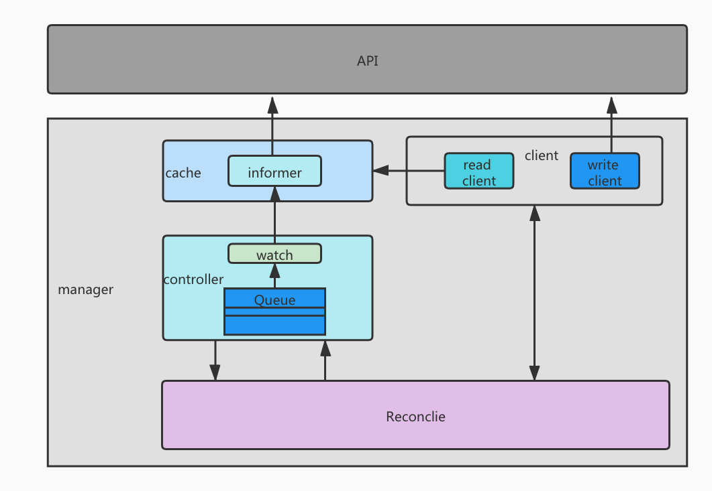

# controller-runtime

1. 首先初始化 schema，注册原生资源以及自定义资源
2. 创建并初始化 manager，将 schema 传入，并在内部初始化 cache 及 client 等资源
3. 创建 Reconciler，传入 client 和 schema
4. 将 Reconciler 注册到 manager，并创建 controller 与 Reconciler 绑定
5. controller watch CR，此时 controller 实际 watch 的是 cache 里的 share informer，将得到的 CR name 和 namespace 放入 Queue 中
6. controller 不断获取 Queue 里的数据并调用 Reconcile

# manager

Initializes shared dependencies such as Caches and Clients, and provides them to Runnables. 

负责管理 controller，caches，client，以及 leader 选举。

# schema

定义了资源序列化和反序列化的方法，以及资源类型和版本的对应关系。可以根据 GVK 找到 go type，也可以根据 go type 找到 GVK.